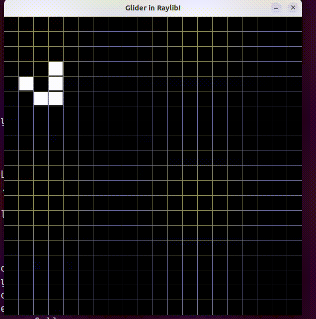

### Simple Game of Life Implementation in C using Raylib.

This is a simple implementation of [Conway's Game of Life](https://en.wikipedia.org/wiki/Conway%27s_Game_of_Life) written in C, that shows a glider on the screen using [Raylib](https://www.raylib.com/).



Before compiling, install [Raylib](https://www.raylib.com/).

##### Compile:

```console
make
```

##### Run:

```console
./main
```
