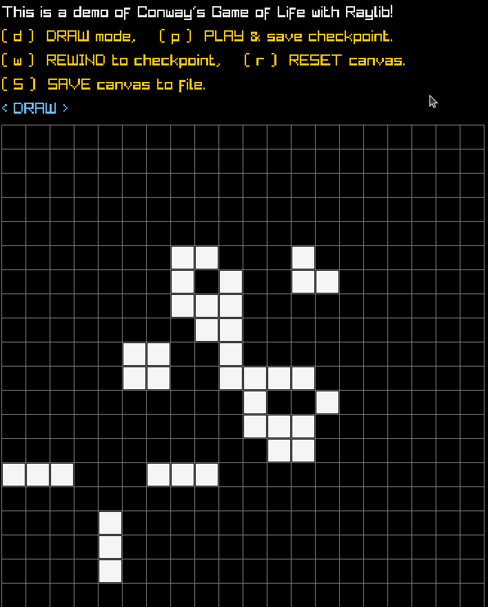

## Interactive Game of Life Implementation in C using Raylib.

This is an implementation of [Conway's Game of Life](https://en.wikipedia.org/wiki/Conway%27s_Game_of_Life) written in C, using [Raylib](https://www.raylib.com/) for the graphics.
The cells grid is initialised with a simple [Glider](https://conwaylife.com/wiki/Glider), or with a saved state from a file argument.

### Compile and Run:

```console
make && ./gol ["state.gol"]
```

### TODO:

- [x] Load state from file
- [x] Save state to file
- [ ] Allow mouse dragging in DRAW mode (?)

### Controls

- (d): enter DRAW mode and use mouse to spawn/kill cells on the canvas
- (p): save current state in a checkpoint and PLAY from it
- (w): REWIND to the state saved in the checkpoint
- (r): RESET to an empty canvas
- (S): SAVE the current state to a file (`state.gol`) to be able to load it in a future session

### Video example:

[](./gol-raylib-demo.mp4)

Before compiling, install [Raylib](https://www.raylib.com/).
